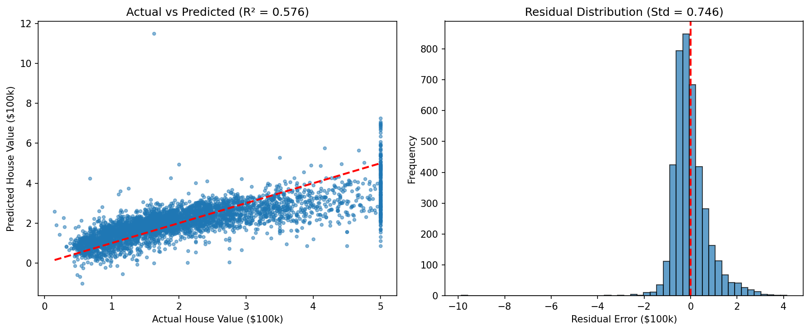

# 🏠 California Housing Price Prediction

**Author:** Diell Fazliu  

---

## 📋 Project Overview

This project predicts median house values in California districts using **Linear Regression**. It demonstrates a complete machine learning workflow including data loading, preprocessing, model training, evaluation, and overfitting detection.

### Dataset
- **Source:** California Housing Dataset (1990 census)
- **Samples:** 20,640 districts
- **Features:** 8 (income, house age, rooms, population, location, etc.)
- **Target:** `MedHouseVal` (median house value in $100,000)

---

## 📊 Results

### Model Performance

| Metric | Training Set | Test Set |
|--------|--------------|----------|
| **RMSE** | $71,968 | $74,558 |
| **MAE** | $52,863 | $53,320 |
| **R² Score** | 0.6126 | 0.5758 |

### Overfitting Check
- **R² difference (train - test):** 0.0368
- **Verdict:** ✅ Mild overfitting — acceptable for a baseline model

### Key Insight
Median Income is the strongest predictor of house value with a correlation of **0.688**.

---

## 📈 Visualizations

### Actual vs Predicted Values

*Left: Actual vs Predicted scatter plot showing model performance (R² = 0.576)*  
*Right: Distribution of residuals (errors) with standard deviation 0.78*

---

## 🛠️ Tech Stack

| Tool | Purpose |
|------|---------|
| Python 3.9+ | Core language |
| pandas | Data manipulation |
| numpy | Numerical operations |
| scikit-learn | Machine learning (model, metrics, split) |
| matplotlib | Visualization |

---

## 📁 Project Structure
