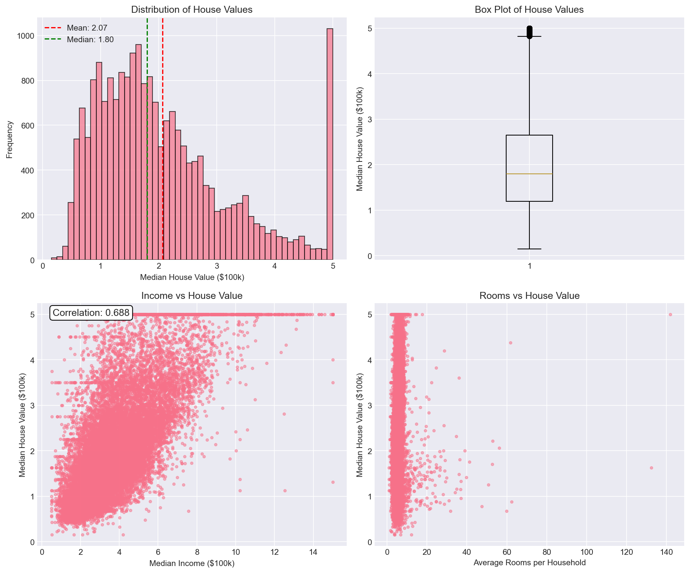

# 🏠 California Housing Price Prediction

**Author:** Diell Fazliu  
**Date:** April 2026

---

## 📋 Project Overview

This project predicts median house values in California districts using **Linear Regression**. It demonstrates a complete machine learning workflow including data exploration, preprocessing, model training, evaluation, and overfitting detection.

### Dataset
- **Source:** California Housing Dataset (1990 census)
- **Samples:** 20,640 districts
- **Features:** 8 (income, house age, rooms, population, location, etc.)
- **Target:** `MedHouseVal` (median house value in $100k)

---

## 📊 Results

### Model Performance

| Metric | Training Set | Test Set |
|--------|--------------|----------|
| **RMSE** | $71,968 | $74,558 |
| **MAE** | $52,863 | $53,320 |
| **R² Score** | 0.6126 | 0.5758 |

### Overfitting Check
- **R² difference:** 0.0368 (3.7%)
- **Verdict:** ✅ Mild overfitting — acceptable and expected for this model

### Key Findings

| Insight | Value |
|---------|-------|
| Strongest predictor | Median Income (correlation: 0.688) |
| Location matters | Latitude & Longitude have moderate impact |
| Rooms per household | Weak positive correlation (0.152) |

### Feature Importance (Coefficients)

| Feature | Coefficient | Impact |
|---------|-------------|--------|
| AveBedrms | +0.7831 | Positive |
| MedInc | +0.4487 | Positive |
| Longitude | -0.4337 | Negative |
| Latitude | -0.4198 | Negative |
| AveRooms | -0.1233 | Weak negative |

---

## 📈 Visualizations

### Actual vs Predicted Values

*The model captures the general trend but struggles with very high-value properties (>$500k).*

### EDA Plots

*Top-left: Distribution of house values (right-skewed)  
Top-right: Box plot showing outliers  
Bottom-left: Strong positive correlation between income and house value  
Bottom-right: Weak relationship between rooms and house value*

---

## 🛠️ Tech Stack

| Tool | Purpose |
|------|---------|
| Python 3.9+ | Core language |
| pandas | Data manipulation |
| numpy | Numerical operations |
| scikit-learn | Machine learning |
| matplotlib & seaborn | Visualization |

---
